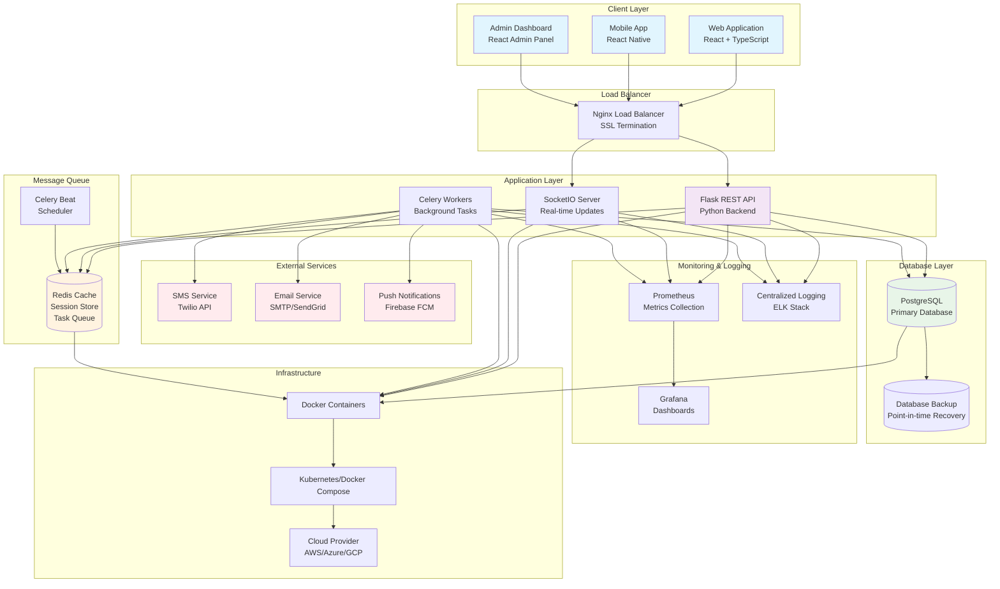

# GUVNL Queue Management System Architecture

## System Architecture Diagram

## Component Details

### **Client Applications**
- **Web Application**: Progressive Web App (PWA) for citizens
- **Mobile Application**: Native mobile experience with offline capabilities
- **Admin Dashboard**: Staff interface for queue management and analytics

### **API Gateway & Load Balancer**
- **Nginx**: Handles SSL termination, static file serving, and load balancing
- **Rate Limiting**: API rate limiting to prevent abuse
- **CORS**: Cross-origin resource sharing configuration

### **Backend Services**
- **Flask REST API**: Main application server handling business logic
- **SocketIO Server**: Real-time bi-directional communication
- **Celery Workers**: Asynchronous task processing for notifications
- **Background Scheduler**: Automated cleanup and maintenance tasks

### **Data Layer**
- **PostgreSQL**: ACID-compliant relational database
- **Redis**: In-memory store for caching, sessions, and message queuing
- **Database Backup**: Automated backup and point-in-time recovery

### **External Integrations**
- **SMS Gateway**: Twilio for SMS notifications
- **Email Service**: SMTP/SendGrid for email notifications
- **Push Notifications**: Firebase FCM for mobile push notifications

### **Monitoring & Observability**
- **Metrics**: Prometheus for system and application metrics
- **Dashboards**: Grafana for visualization and alerting
- **Logging**: Centralized logging with search and analysis capabilities

## Data Flow

### **Appointment Booking Flow**
1. Citizen accesses web/mobile app
2. Authenticates or registers as guest user
3. Selects service type and preferred time slot
4. System generates digital token with queue position
5. Real-time queue updates via WebSocket
6. SMS/Email confirmation sent via background worker

### **Queue Management Flow**
1. Staff logs into admin dashboard
2. Views current queue status and metrics
3. Can call next customer or modify queue
4. System updates queue positions in real-time
5. Notifications sent to affected customers
6. Performance metrics recorded for analysis

### **Notification Flow**
1. Queue status change triggers background task
2. Celery worker processes notification request
3. Appropriate service (SMS/Email/Push) called
4. Delivery status tracked and logged
5. Failed notifications retried with exponential backoff

## Security Considerations

- **Authentication**: JWT tokens with refresh mechanism
- **Authorization**: Role-based access control (RBAC)
- **Data Encryption**: HTTPS/TLS for all communications
- **Database Security**: Encrypted connections and data at rest
- **Rate Limiting**: API throttling and DDoS protection
- **Input Validation**: Comprehensive input sanitization
- **Audit Logging**: All sensitive operations logged

## Scalability Features

- **Horizontal Scaling**: Multiple API server instances
- **Database Scaling**: Read replicas and connection pooling
- **Cache Layer**: Redis cluster for high availability
- **CDN Integration**: Static asset delivery optimization
- **Auto Scaling**: Container orchestration with resource monitoring

## Performance Optimizations

- **Database Indexing**: Optimized queries with proper indexes
- **API Caching**: Response caching for frequently accessed data
- **Connection Pooling**: Efficient database connection management
- **Lazy Loading**: Frontend components loaded on demand
- **Image Optimization**: Compressed and optimized media assets